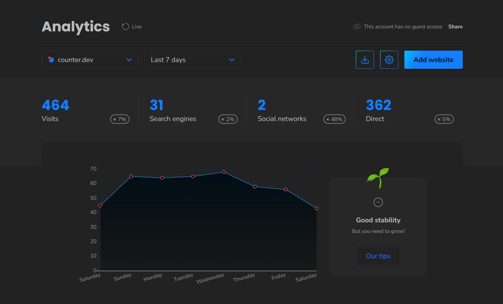

# counter.dev dark

## Preview

## Installation

1. Install Stylus/Cascadea (Safari)
   -  [Chrome](https://chrome.google.com/webstore/detail/stylus/clngdbkpkpeebahjckkjfobafhncgmne)
   -  [Firefox](https://addons.mozilla.org/en-US/firefox/addon/styl-us/)
   -  [Opera](https://addons.opera.com/en-gb/extensions/details/stylus/)
   -  [Safari](https://cascadea.app/)
1. [Install UserCSS](https://github.com/VChet/counter.dev-dark/raw/master/counter.dev-dark.user.css)

## Contribute

Anyone and everyone is welcome to [contribute](https://github.com/VChet/counter.dev-dark/pulls) and report any [issues](https://github.com/VChet/counter.dev-dark/issues).

## Development

1. [Fork](https://github.com/VChet/counter.dev-dark/fork) and download this repository
1. Install [Node.js](https://nodejs.org/)
1. Install all dependencies using `npm install`
1. Change [mappings](generate.js)
1. Generate style with `npm run generate`
1. Make additional changes in `counter.dev-dark.user.css` if needed
1. Commit and push your changes
1. Make a pull request
